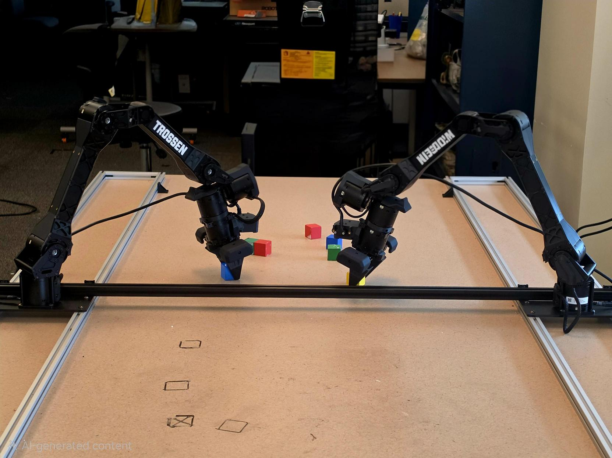

```{=html}
<div class="page-banner">
  
  <div class="hero-content">
    <div class="hero-eyebrow">Life at the lab</div>
    <div class="hero-title-top">Gallery</div>
  </div>
</div>

<div class="gallery-grid">
  <!-- GALLERY_START -->
  <a href="../images/work/377A0851.jpg" class="gallery-item lightbox" data-gallery="lab-gallery">
    
  </a>
  <a href="../images/work/377A0883.jpg" class="gallery-item lightbox" data-gallery="lab-gallery">
    
  </a>
  <a href="../images/work/377A0891.jpg" class="gallery-item lightbox" data-gallery="lab-gallery">
    
  </a>
  <a href="../images/work/377A0907.jpg" class="gallery-item lightbox" data-gallery="lab-gallery">
    
  </a>
  <a href="../images/work/377A0918.jpg" class="gallery-item lightbox" data-gallery="lab-gallery">
    
  </a>
  <a href="../images/work/377A0919.jpeg" class="gallery-item lightbox" data-gallery="lab-gallery">
    
  </a>
  <a href="../images/work/377A0920.jpeg" class="gallery-item lightbox" data-gallery="lab-gallery">
    
  </a>
  <!-- GALLERY_END -->
</div>
```
