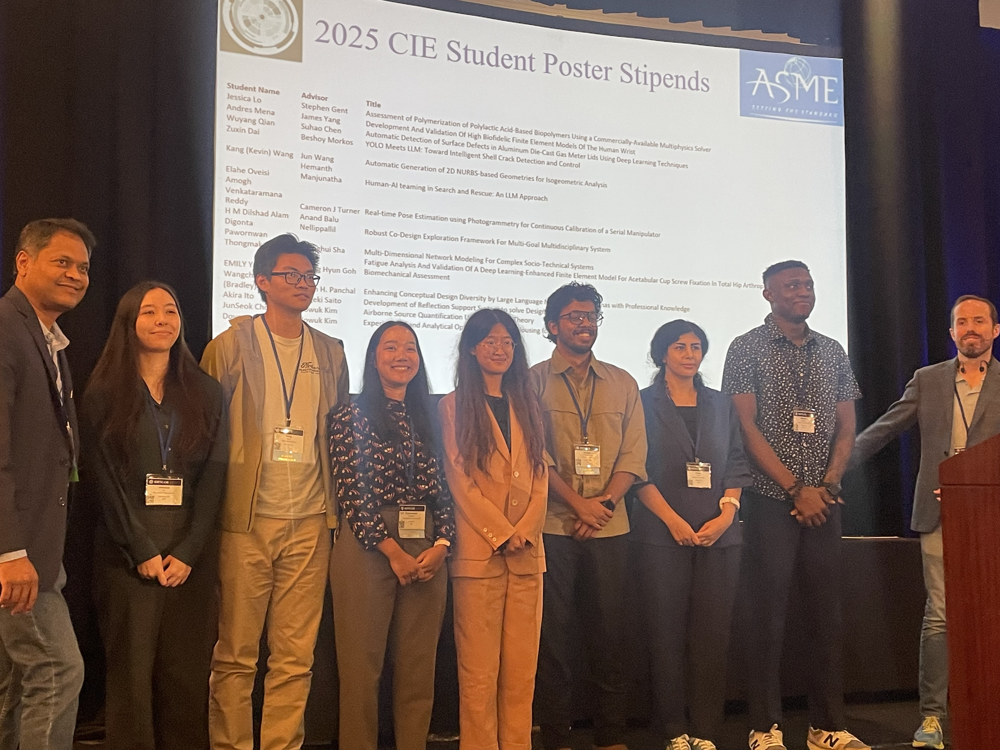

{fig-align=center}

## iHuman Lab Ph.D. Student Receives ASME IDETC Travel Award

Graduate students in the iHuman Lab continue to earn national recognition for their research excellence. Elahe Oveisi, a Ph.D. student in the lab, received a Graduate Poster Travel Award at the American Society of Mechanical Engineers International Design Engineering Technical Conferences (IDETC).

At the conference, she presented her paper titled *“Human Factor Analysis of Helicopter Accidents using Large Language Models.”* Her research explores the integration of advanced AI techniques with human factors analysis to better understand and mitigate risks in safety-critical aerospace systems. By leveraging large language models to analyze accident data, her work contributes to improving safety assessment methodologies and advancing intelligent decision-support tools for complex engineering environments.

This achievement reflects the iHuman Lab’s continued commitment to innovation at the intersection of artificial intelligence, human-centered design, and safety-critical systems research.
