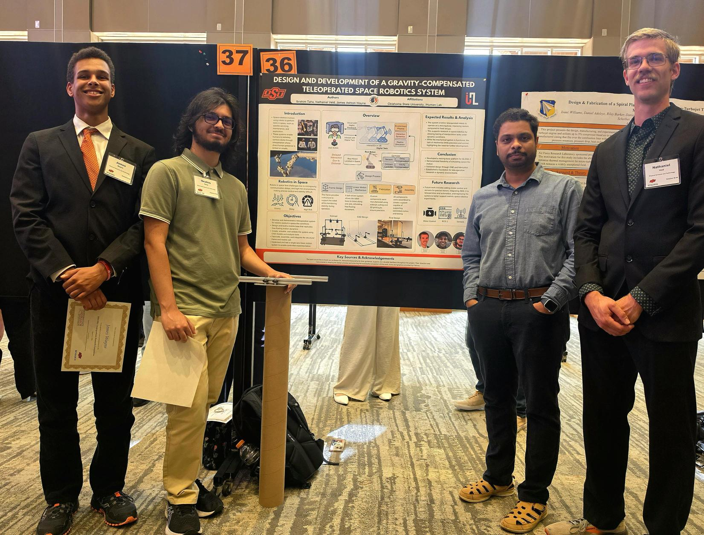

{fig-align=center}

## iHuman Lab Undergraduates Showcase Space Robotics System at OSU Research Symposium

We are proud to share that three undergraduate researchers from the iHuman Lab — **Ibrahim Taha**, **Nathaniel Veld**, and **James Ashton Wayne** — presented their work at the [Oklahoma State University Undergraduate Research Symposium](https://research.okstate.edu/student-research/undergrad-research-symposium).

Their project, *"Design and Development of a Gravity-Compensated Teleoperated Space Robotics System,"* tackled one of the fundamental challenges in space robotics: testing robot manipulation under realistic, free-floating conditions here on Earth.

### The Challenge

Robots operating in space must contend with microgravity, communication delays, and high-risk environments — all of which make precise control exceptionally difficult. Most ground-based testbeds use fixed platforms that fail to capture the dynamic nature of space operations, limiting the realism of experiments.

### What They Built

The team designed and fabricated a moving-base platform for the ALOHA 2 robot that simulates free-floating motion dynamics. Key aspects of the system include:

- A **belt-driven linear motion system** that allows the robot base to travel along a single axis, replicating the unconstrained movement of a spacecraft
- A **structural frame** that supports the robot while maintaining stability during operation
- **Custom components** manufactured using waterjet cutting and 3D printing for precision fit and assembly

The design was validated through CAD modeling and simulation before physical fabrication, and the assembled system was demonstrated as a functional platform for teleoperation research in dynamic environments.

### Looking Ahead

While the mechanical system is fully operational, the team identified integrating motor control and sensors as the critical next step for enabling precise, repeatable motion. Future development will also include ROS 2 integration to support teleoperation workflows and automation, bringing the platform closer to realistic space robotics experimentation.

This project establishes a strong foundation for ongoing research in the iHuman Lab on human-robot teaming and teleoperation in challenging environments.

Congratulations to Ibrahim, Nathaniel, and James on an outstanding presentation!
