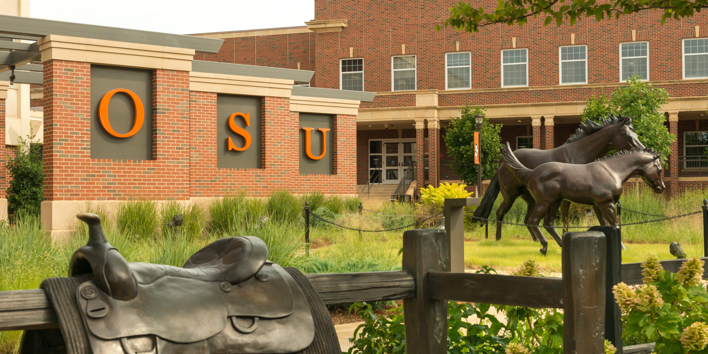

---
listing:
  contents:
    - "*/index.qmd"
  template: ../assets/outreach.ejs
  fields: [title, description, date, venue, event_type, event_category, conference_url, image, path]
  sort: "date desc"
  max-items: 50
toc: false
page-layout: full
---

```{=html}
<div class="page-banner">
  
  <div class="hero-content">
    <div class="hero-eyebrow">Engaging beyond the lab</div>
    <div class="hero-title-top">Outreach <span class="hero-title-accent">& Impact</span></div>
  </div>
</div>
```
