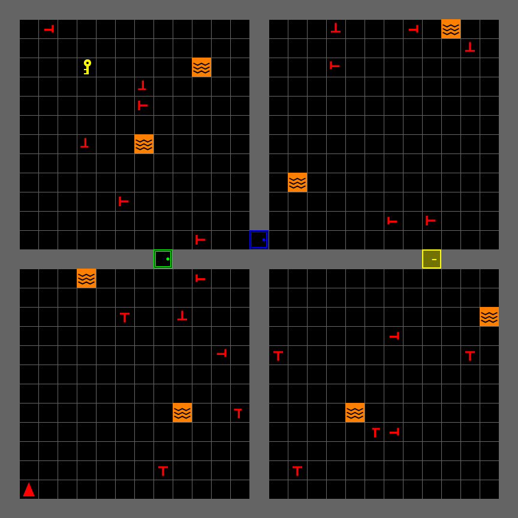
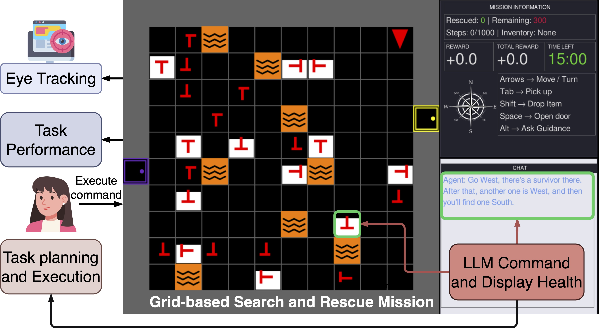
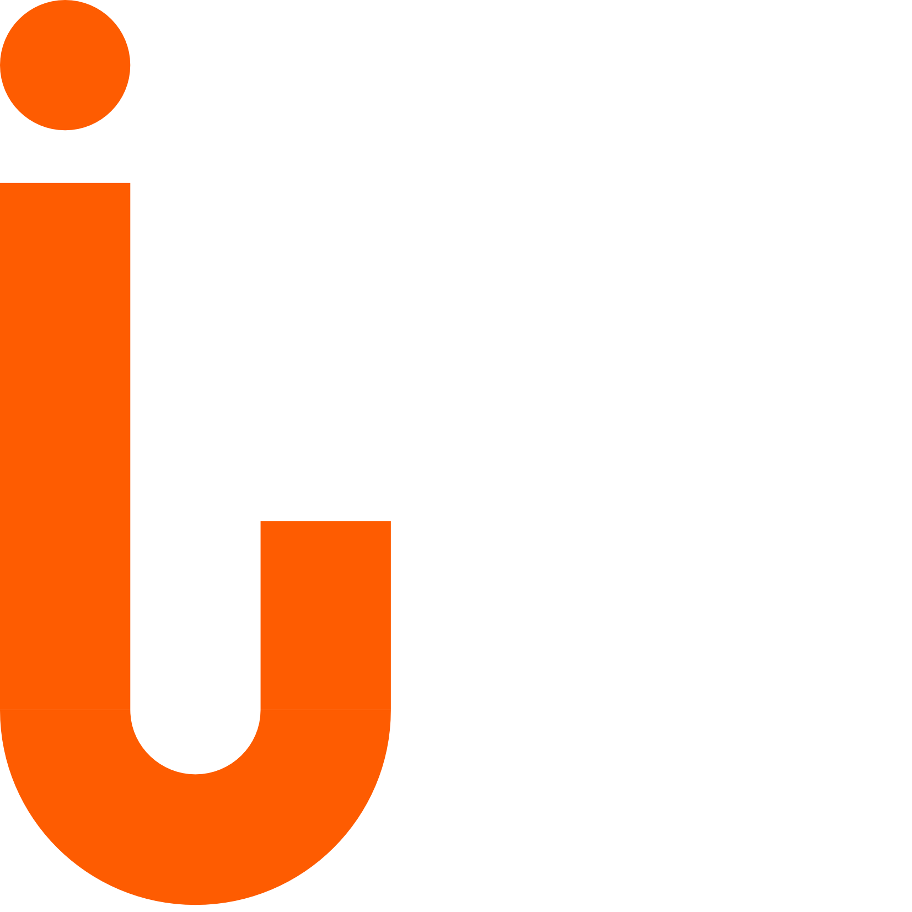

## Why We Built [Another]{.accent} Sim {background-color="#252525"}

::: {.columns}
::: {.column width="55%"}

::: {.hook}
Studying trust and workload needs a task you can [control]{.accent} — and repeat.
:::

Real disasters aren't reproducible. Field studies can't isolate one variable at a time, and they definitely can't be replayed frame-by-frame in analysis.

We needed a SAR task that was **hard enough to matter**, **controllable enough to manipulate**, and **instrumented enough to measure**.

::: {.punchline}
So we built [Rescue-Grid]{.accent}.
:::

:::
::: {.column width="45%"}

:::
:::

---

## From [Concept]{.accent} to Testbed {background-color="#252525"}

::: {.hook}
Everything from Part 1 is a config parameter or a log field here.
:::

- **Situational Awareness** — swappable camera views (full grid &rarr; FOV cone) control what's perceivable; victim health depletes while visible, forcing perceive &middot; comprehend &middot; project
- **Trust** — the optional LLM assistant offers a suggestion each step; accept/reject is logged automatically, a behavioral trust signal, not just a post-task survey
- **Mental Workload** — real vs. decoy victims, lava density, room count are the same demand-vs-capacity dials NASA-TLX asks about, except here they're `build_sar_env()` arguments
- **Physiological Measurement** — every game state syncs to Tobii (or any sensor you register) over one LSL clock, so fixations and pupil size line up frame-by-frame with gameplay

::: {.punchline}
Part 1 asked what to measure. Rescue-Grid is [where]{.accent} you measure it.
:::

---

## The [Game]{.accent} {background-color="#252525"}

::: {.columns}
::: {.column width="35%"}

::: {.hook}
A building on fire. Real victims. Fake ones too.
:::

- Multi-room building, locked doors + keys
- Real victims vs. decoy victims — pick up the wrong one, take a penalty
- Lava hazards, and victim health that **depletes while visible**
- Optional LLM assistant you can call on for a suggestion

::: {.punchline}
Built on [MiniGrid]{.accent} + Gymnasium — so it's RL-ready from day one.
:::

:::
::: {.column width="65%"}
<video data-autoplay loop muted playsinline src="screenshots/Media2.mov" style="width:100%; border-radius:6px; box-shadow:0 4px 20px rgba(0,0,0,0.4);"></video>
:::
:::

---

## Ten Lines to a Running [Environment]{.accent} {background-color="#252525"}

::: {.columns}
::: {.column width="50%"}

::: {.hook}
It's a standard Gymnasium environment underneath.
:::

`reset()` / `step()` / `render()` — nothing exotic. Drop in your own policy, or drive it by hand.

::: {.punchline}
If you know Gymnasium, you already [know]{.accent} Rescue-Grid.
:::

:::
::: {.column width="50%"}
```python
from game.sar.env import build_sar_env

env = build_sar_env(
    screen_size=800,
    num_rows=2, num_cols=2,
    num_real_victims=3,
    num_fake_victims=3,
    lava_per_room=2,
)

obs, info = env.reset(seed=42)
for _ in range(200):
    action = env.action_space.sample()
    obs, reward, terminated, truncated, info = env.step(action)
    if terminated or truncated:
        obs, info = env.reset()
```
:::
:::

---

## Engine [Architecture]{.accent}: One Step, Start to Finish {background-color="#252525"}

::: {.hook}
Every frame follows the same path — input to pixels.
:::

<div class="flow-diagram">
<div class="flow-step"><strong>Keyboard Input</strong></div>
<div class="flow-arrow">&#9660;</div>
<div class="flow-step"><strong>PickupVictimEnv.step(action)</strong><br>move / rescue · deplete health · check mission state</div>
<div class="flow-arrow">&#9660;</div>
<div class="flow-step"><strong>GameObservation.process()</strong><br>encodes grid, position, mission status</div>
<div class="flow-arrow">&#9660;</div>
<div class="flow-step"><strong>SAREnvGUI.render()</strong><br>camera crop + info panel + chat panel</div>
</div>

---

## [Extensible]{.accent} By Design {background-color="#252525"}

::: {.columns}
::: {.column width="55%"}

- **Strategy** — 5 swappable camera views: full grid, agent-centered, first-person, FOV cone
- **Factory** — `build_sar_env()` assembles a fully configured mission from a few parameters
- **Template Method** — `SARLevelGen` defines level-gen hooks; subclass it for a new level type
- **Pluggable Placers** — `VictimPlacer` / `LavaPlacer` swap placement logic without touching the engine

::: {.punchline}
Change the [scenario]{.accent}, not the source code.
:::

:::
::: {.column width="45%"}
```python
# Strategy: swap the camera at runtime
env.switch_camera(AgentFOVCamera())

# Factory: reconfigure the mission
env = build_sar_env(
    num_real_victims=6,
    num_fake_victims=12,
    lava_per_room=8,
    locked_room_prob=0.5,
)
```
:::
:::

---

## How [LSL]{.accent} and `ixp` Talk to Each Other {background-color="#252525"}

::: {.hook}
Two independent streams. One shared clock.
:::

<div class="flow-diagram">
<div class="flow-branch">
<div class="flow-step"><strong>SARGameTrial</strong><br>read_data() every frame</div>
<div class="flow-step"><strong>Tobii Eye Tracker</strong><br>gaze samples</div>
</div>
<div class="flow-arrow">&#9660;</div>
<div class="flow-step"><strong>LSL</strong> — Lab Streaming Layer<br>synchronized clock across both streams</div>
<div class="flow-arrow">&#9660;</div>
<div class="flow-step"><strong>Recorded Session</strong> &rarr; replayed frame-by-frame with <code>replay.py</code></div>
</div>

---

## What Is [`ixp`]{.accent}? {background-color="#252525"}

::: {.columns}
::: {.column width="50%"}

::: {.hook}
Behavioral experiments have a shape: setup, tasks, sensors, teardown.
:::

`ixp` is iHuman Lab's experiment engine — an `Experiment` runs a sequence of `Task`s, each broken into `Block`s of `Trial`s, predefined or randomized order.

Sensors record in **parallel** with tasks via Ray, and everything streams to a synchronized LSL clock — no manual timestamp alignment.

::: {.punchline}
Rescue-Grid didn't reinvent this — it just [registered]{.accent} as a Task.
:::

:::
::: {.column width="50%"}
<div class="flow-diagram">
<div class="flow-step"><strong>experiment.run()</strong></div>
<div class="flow-arrow">&#9660;</div>
<div class="flow-step"><strong>Start Sensors</strong> (parallel, non-blocking)</div>
<div class="flow-arrow">&#9660;</div>
<div class="flow-step"><strong>Tasks &rarr; Blocks &rarr; Trials</strong><br>run sequentially, push LSL markers</div>
<div class="flow-arrow">&#9660;</div>
<div class="flow-step"><strong>Stop Sensors</strong> &rarr; <strong>experiment.close()</strong></div>
</div>
:::
:::

---

## Rescue-Grid Is a [Task]{.accent} Inside `ixp` {background-color="#252525"}

::: {.columns}
::: {.column width="50%"}

::: {.hook}
`ixp` orchestrates the session — Rescue-Grid just plugs in.
:::

`ixp.Experiment` runs an ordered sequence of **Tasks**, calibrates **sensors**, and drives everything to completion. Rescue-Grid supplies one `Task` (`SARGame`) whose trials stream to their own LSL outlet.

::: {.punchline}
Your sensor could be the [next]{.accent} one registered.
:::

:::
::: {.column width="50%"}
```python
class SARGame(Task):
    def get_data_signature(self):
        return {
            "name": "SARGame",
            "type": "GameState",
            "channel_format": "string",
            "source_id": "rescue-grid-sar-game",
        }

class SARGameTrial(LSLTrial):
    def read_data(self):
        state = {**self.gui.user.obs,
                  "action": self.gui.user.last_action,
                  "reward": self.gui.user.last_reward}
        return [ujson.dumps(state)]
```
:::
:::

---

## Use It In [Your]{.accent} Study {background-color="#252525"}

::: {.columns}
::: {.column width="50%"}

::: {.hook}
Two entry points, depending on how deep you want to go.
:::

**Just the environment** — for a scripted study or RL training, no `ixp` required.

**Full experiment** — wire in your own sensor (EEG, GSR, whatever you're measuring) exactly the way Tobii is wired in today.

:::
::: {.column width="50%"}
```python
# (a) minimal — no ixp, just Gymnasium
from game.sar.env import build_sar_env

env = build_sar_env(num_rows=3, num_cols=3)
obs, info = env.reset()
# plug in your own policy or logging here

# (b) full ixp experiment
from ixp.experiment import Experiment
from experiment.game import SARGame

experiment = Experiment(config)
experiment.register_sensor(
    "MyEEG", sensor_cls=MyEEGSensor, sensor_config={}
)
experiment.add_task(
    name="main_game", task_cls=SARGame,
    task_config={"config": config["game"]}, order=1,
)
experiment.run()
```
:::
:::

---

## It Already [Produced]{.accent} a Paper {background-color="#252525"}

::: {.columns}
::: {.column width="55%"}

::: {.hook}
LLM guidance changed *where* people looked — not just how well they did.
:::

- **No** performance gain — victims rescued per step didn't budge
- Attention shifted to the chat panel — an **attention-guidance trade-off**
- Gaze narrowed too: shorter saccades, more localized, text-driven looking

::: {.punchline}
IEEE SMC 2026 — [Oveisi & Manjunatha]{.accent}
:::

:::
::: {.column width="45%"}

:::
:::

---

## Come Find Us at [NeuroErgonomics]{.accent} {background-color="#252525"}

::: {.hook}
Same platform, a different question — see you at the session.
:::

- **Wednesday, July 15 — Sessions 4–6**
- **Session 6: Human–Robot & Human–AI Teaming** (Chair: Alexander von Lühmann)
- *LLM-Mediated Communication in Human–AI Teaming: A Physiological Monitoring Study for Search and Rescue*

---

## {background-image="../../images/campus/campus_2.jpg" background-opacity="0.25" background-color="#252525"}

::: {style="display:flex; flex-direction:column; align-items:center; justify-content:center; height:80vh; text-align:center;"}

{style="max-height:110px; border-radius:0 !important; box-shadow:none !important;"}

::: {style="font-family:'Rubik',sans-serif; font-size:2.8rem; font-weight:900; color:#ffffff; margin-top:0.8rem;"}
Fork It. [Build Your Study.]{style="color:#EC672C;"}
:::

::: {style="font-size:1.5rem; color:rgba(255,255,255,0.65); margin-top:0.5rem; max-width:700px; line-height:1.6;"}
github.com/iHuman-Lab/rescue-grid
:::

::: {style="font-size:1.5rem; color:#EC672C; margin-top:1.2rem; font-weight:700;"}
Questions?
:::

::: {style="font-size:1.5rem; color:rgba(255,255,255,0.35); margin-top:1rem; letter-spacing:2px;"}
hemanth.manjunatha@okstate.edu
:::

:::
