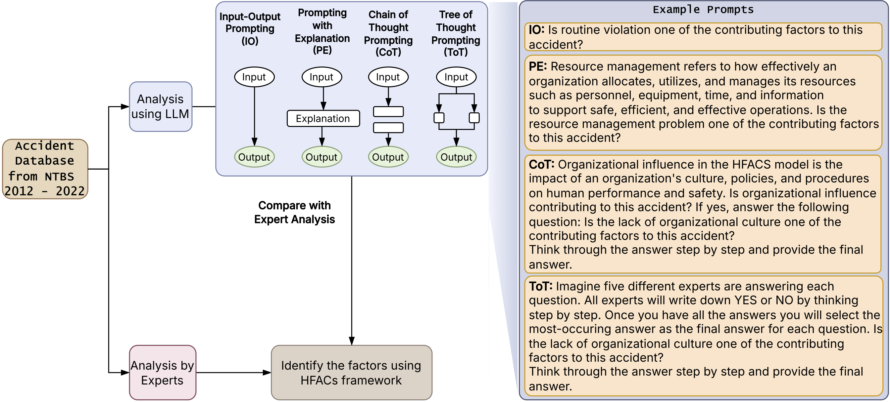

{fig-align="center"}

# Using AI to Uncover the Human Factors Behind Helicopter Accidents

While helicopter travel is statistically rarer than commercial airline flights, accidents in this sector remain a critical safety concern. From search-and-rescue missions to private charters, these incidents often carry higher fatality rates due to low-altitude operations.

Recent research from Oklahoma State University, presented at the **ASME 2025 International Mechanical Engineering Congress**, explores how we can move from manual, month-long investigations to rapid, AI-driven analysis using **Large Language Models (LLMs)**.

## The Challenge: Why Human Factors Matter

Safety experts estimate that **human factors**—a blend of psychological states, environmental design, and organizational culture—contribute to over 80% of aviation accidents. Traditionally, investigators use the **Human Factors Analysis and Classification System (HFACS)** to categorize these issues.

The problem? Manual HFACS analysis is:

* **Slow:** Identifying probable causes can take 12–24 months.
* **Subjective:** Different experts might interpret the same narrative differently.
* **Data-Heavy:** Investigating a decade of reports is a massive undertaking for human teams.

## The Solution: Prompt Engineering for Safety

The researchers analyzed 215 fatal helicopter accidents (2012–2022) from the NTSB database. To see if AI could handle the heavy lifting, they tested six different **LLM prompting techniques** to see which could best identify "root causes" from raw accident narratives.

### The Methods Tested:

1. **Input-Output (IO):** Simple question and answer.
2. **Prompting with Explanation (PE):** Providing the AI with context before asking.
3. **Chain-of-Thought (CoT):** Asking the AI to "think step-by-step."
4. **Tree-of-Thought (ToT):** Allowing the AI to explore multiple reasoning paths and backtrack if it hits a dead end.
5. **Multiple Question Variants (IOM/PEM):** Consolidating all HFACS questions into a single, comprehensive prompt.

## Results: Which AI Strategy Won?

The study found that **Tree-of-Thought (ToT)** was the clear winner for complex accident analysis.

### Key Findings:

* **High Accuracy:** ToT achieved an **F1-score of >0.9**, meaning it was incredibly reliable at matching the "ground truth" established by human experts.
* **Strengths:** The models were exceptionally good at identifying **Skill-Based Errors** and **Physical/Mental Limitations** (with F1-scores near 0.99).
* **Weaknesses:** Even the best AI struggled with "subtle" factors. **Communication failures** and **Routine violations** (habitual rule-breaking) were much harder for the models to detect, likely due to the nuance required to read between the lines of a technical report.

## Where the Accidents Happen

The database analysis also revealed interesting trends in helicopter safety within the U.S.:

* **Texas** saw the highest frequency of accidents during the study period.
* **Personal flights** were more frequently involved in fatal incidents than commercial or rescue operations.
* **Decision-making errors** were the most common human factor identified in the reports, appearing in over 100 of the 215 cases analyzed.

## The Future of Aviation Safety

This research proves that while AI isn't ready to replace human investigators entirely—especially for nuanced social and communicative factors—it can act as a powerful **force multiplier**.

By using optimized prompting like **Tree-of-Thought**, aviation authorities can process thousands of reports in minutes, identifying systemic safety gaps and informing better training for pilots. As LLMs continue to evolve, the gap between human intuition and machine processing is closing, promising a future where we learn from accidents faster than ever before.

> **Research Citation:** Oveisi, E., & Manjunatha, H. (2025). *Human Factor Analysis of Helicopter Accidents using Large Language Models*. Proceedings of the ASME 2025 International Mechanical Engineering Congress and Exposition.