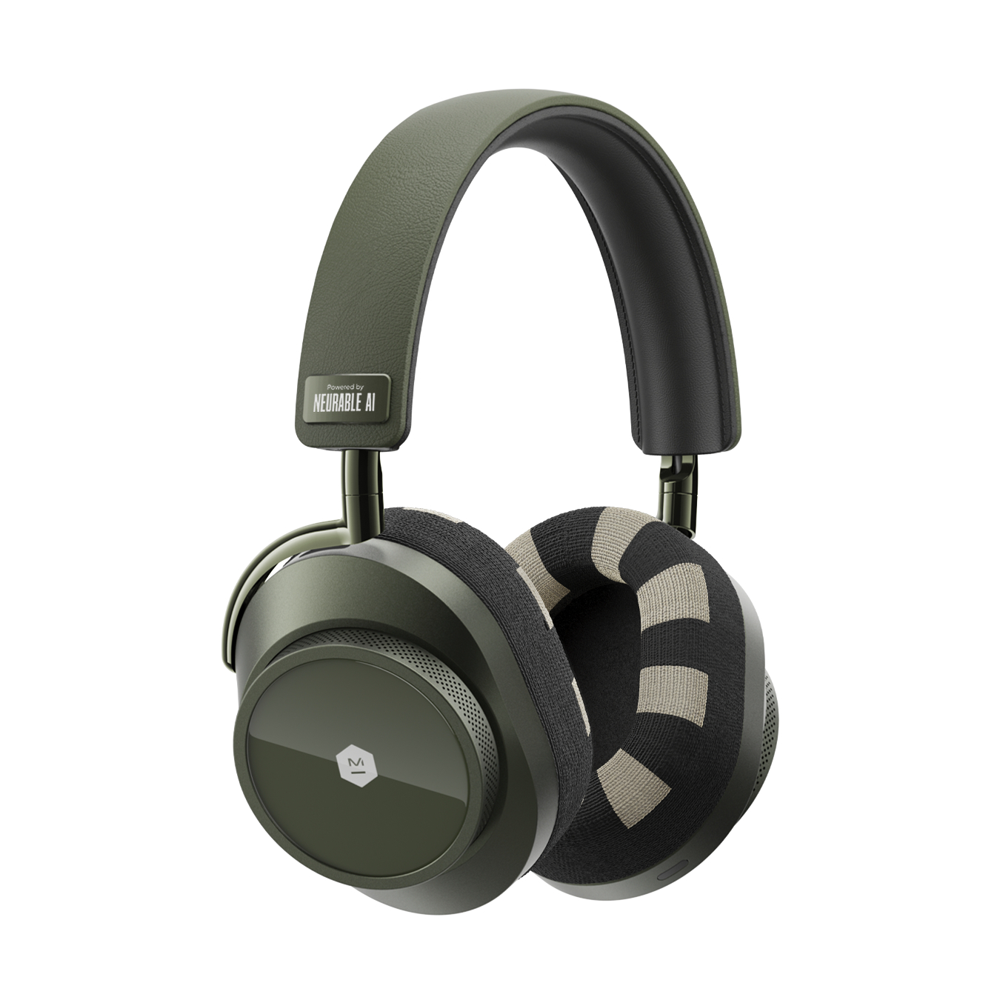

{fig-align=center}

We’re excited to kick off 2026 with some amazing news! The **iHuman Lab at Oklahoma State University** has been selected for the **Neurable Research Grant**, giving our team access to cutting-edge EEG tools to fuel the next wave of brain research.

The Neurable Research Grant program is designed to make professional-grade neurotechnology accessible to researchers worldwide. With the **Neurable Research Kit**, a compact 12-channel EEG device with research-grade precision, our lab will explore innovative projects at the intersection of **neuroscience, AI, and human-centered systems**.

This grant empowers us to:

* Use high-quality EEG devices with **24-bit precision** and **500 Hz sampling rate**, ensuring reliable neural data.
* Conduct research with **professional-grade tools** and perpetual licenses—no subscriptions, no hidden costs.
* Accelerate ethics approval and data collection with complete IRB support.
* Join a global network of researchers democratizing brain–computer interface research.

We’re thrilled to leverage this opportunity to push boundaries in **cognition, AI-driven neural modeling, and neuroadaptive technologies**, and to contribute to discoveries that could have real-world impact.

A huge thank you to **Neurable** for supporting academic research and enabling labs like ours to explore the frontiers of brain–computer interfaces.

Here’s to an exciting year ahead—stay tuned for updates on our research journey!
